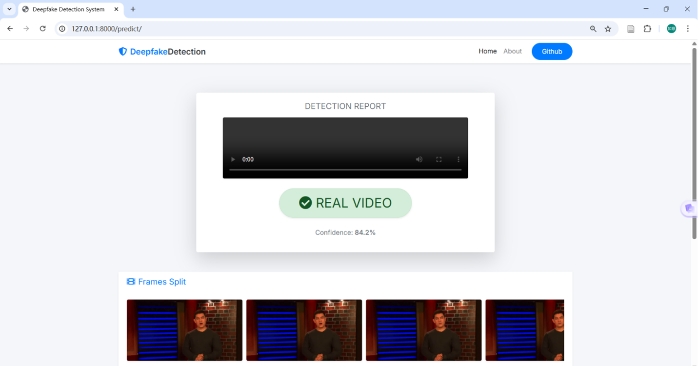
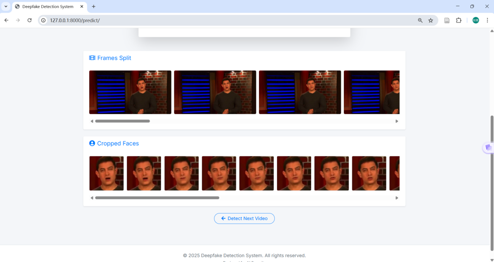

# Deepfake Detection System: An End-to-End Spatio-Temporal Approach


> **Graduate Research Project & Contribution Declaration** 
> This repository showcases an independent experimental project completed during my graduate studies. While the core Spatio-Temporal deep learning architecture (ResNeXt + LSTM) builds upon the foundational open-source work of Abhijit Jadhav et al., **my primary contribution lies in the end-to-end system engineering and deployment.** I independently designed, developed, and dockerized a comprehensive Django-based web application, seamlessly integrating the PyTorch inference pipeline to enable real-time, user-friendly deepfake detection.

## 📖 Project Overview
With the rapid proliferation of hyper-realistic AI-generated media, detecting manipulated facial videos (Deepfakes) has become a critical challenge in multimedia forensics. This project tackles the problem by deploying a Spatio-Temporal neural network architecture. My objective was to bridge the gap between complex backend AI models and practical usability by engineering a robust, fully containerized web interface for real-time video inference and visualization.

## 🎥 Demonstration & Visuals
*(Note for you: It's highly recommended to convert a short segment of your video into a `.gif` file to display directly in the README, and link the full video to YouTube/Bilibili/Google Drive.)*

### System Demo Video
[](YOUR_VIDEO_LINK_HERE)  
*Click the badge above to watch the full demonstration of the system in action.*

### Real-Time Inference Interface
*(Note for you: Replace `demo.gif` and `screenshot.png` with your actual files in the `github_assets` folder)*
### Real-Time Inference Interface

<p align="center">
  <!-- 第一张图：展示系统主页或上传界面 -->
  
  <br>
  <em>Figure 1: The intuitive Django-based web interface designed for easy video uploading.</em>
</p>

<p align="center">
  <!-- 第二张图：展示检测结果页面（包含Fake/Real概率和视频帧） -->
  
  <br>
  <em>Figure 2: Real-time inference results displaying the authenticity probability and frame-level analysis.</em>
</p>
<p align="center">  
<!-- 第三张图：展示检测结果页面（包含Fake/Real概率和视频帧） -->  
  
<br>  
<em>Figure 2: Real-time inference results displaying the authenticity probability and frame-level analysis.</em>
</p>

## 🔬 Backend Methodology (Referenced Architecture)
The core detection engine employs a hybrid Spatio-Temporal architecture designed to capture both frame-level visual artifacts and temporal inconsistencies inherent in synthesized videos:

1. **Spatial Feature Extraction (ResNeXt50):** 
   A Convolutional Neural Network (CNN) is utilized as a spatial feature extractor. Transfer learning is applied to a pre-trained ResNeXt50 model to extract high-dimensional semantic representations from individual isolated facial frames.
2. **Temporal Sequence Analysis (LSTM):** 
   Deepfakes often exhibit unnatural temporal dynamics (e.g., abnormal blinking, micro-flickers). A Long Short-Term Memory (LSTM) network takes the sequential spatial features generated by the CNN to model these temporal dependencies and output a final authenticity probability.

## 📊 Experimental Results & Model Performance
Extensive evaluation was conducted to analyze the impact of temporal sequence length (number of frames processed per video) on the model's predictive accuracy. The evaluation was performed on a dataset comprising 6,000 videos.

| Model Checkpoint | Dataset Size | Frames Processed per Video | Inference Accuracy |
| :--- | :---: | :---: | :---: |
| `model_84_acc_10_frames.pt` | 6000 | 10 | 84.21% |
| `model_87_acc_20_frames.pt` | 6000 | 20 | 87.79% |
| `model_89_acc_40_frames.pt` | 6000 | 40 | 89.34% |
| `model_90_acc_60_frames.pt` | 6000 | 60 | 90.59% |
| `model_91_acc_80_frames.pt` | 6000 | 80 | 91.49% |
| **`model_93_acc_100_frames.pt`**| **6000** | **100** | **93.58%**|

> **Conclusion:** The empirical results demonstrate a positive correlation between the temporal receptive field (frames per video) and the detection accuracy, peaking at 93.58% when analyzing 100 consecutive frames, highlighting the importance of temporal data in deepfake forensics.

## 🛠️ Technical Stack Demonstrated
- **Deep Learning Framework:** PyTorch, Torchvision
- **Computer Vision:** OpenCV, MTCNN (for face extraction)
- **Backend & Web Framework:** Python, Django
- **Deployment & DevOps:** Docker, Docker Compose
- **Frontend:** HTML5, CSS3, JavaScript (Bootstrap)

## 📁 Repository Structure
```text
.
├── Django Application/    # Custom-developed Django web application (My Contribution)
│   ├── app/               # Views, URLs, and real-time inference logic
│   ├── templates/         # UI/UX design (HTML/CSS/JS)
│   └── Dockerfile         # Containerization script
├── Model Creation/        # Data preprocessing and PyTorch training scripts (Referenced)
├── Documentation/         # Project documentation, academic reports, and setup guides
├── github_assets/         # Media assets (GIFs, Screenshots) for README
└── README.md
